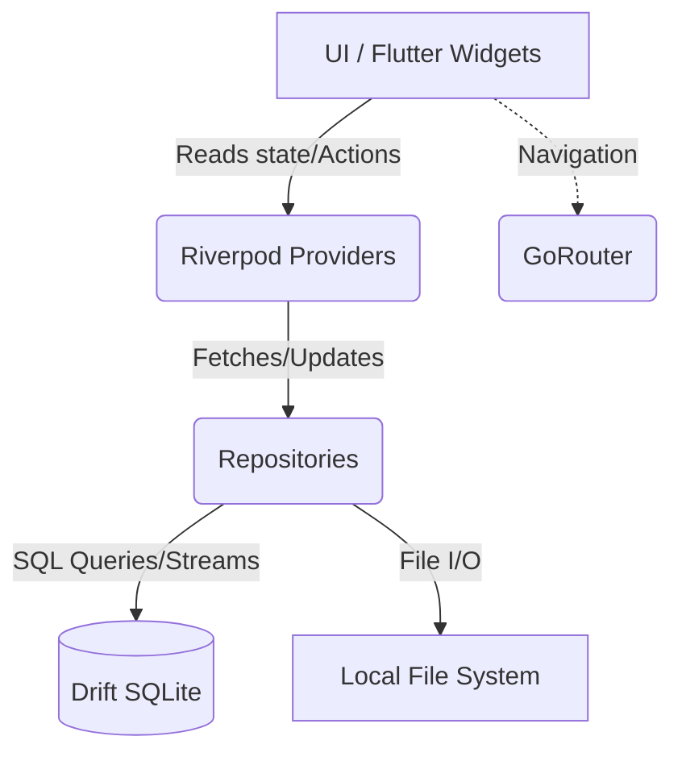
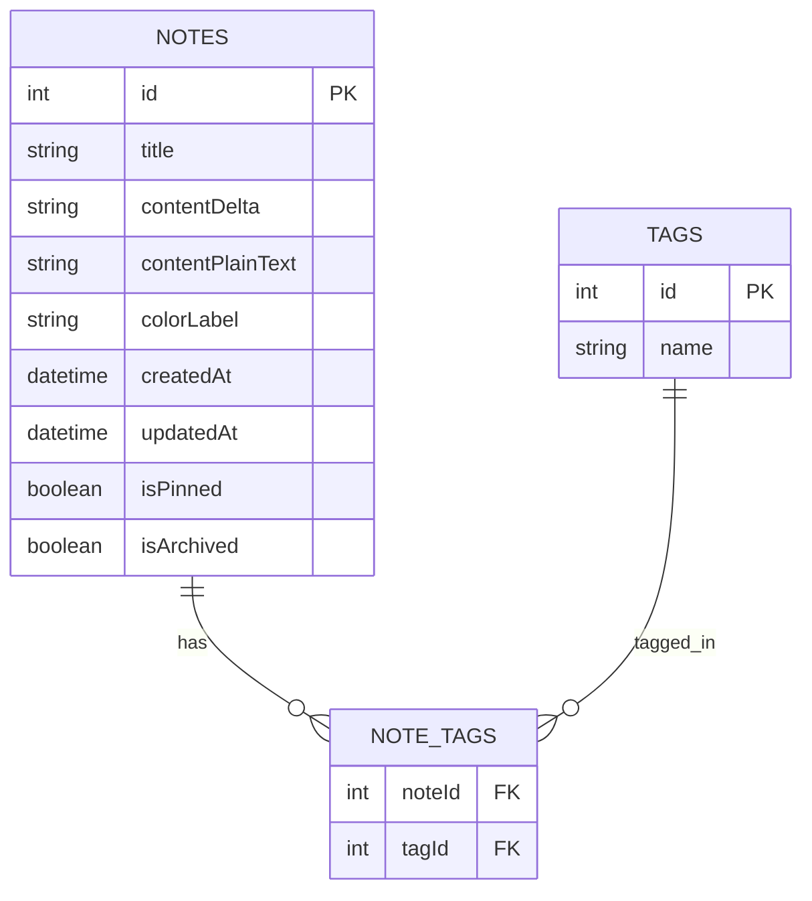

# Inkwell Notes - Design Document

## 1. Overview
Inkwell Notes is an offline-first, typography-focused note-taking application for Android. It aims to provide a premium, fluid, and clutter-free writing experience, inspired by editorial platforms like Medium and Claude. The app operates entirely locally, ensuring total privacy with no network sync or accounts.

## 2. Analysis of the Goal
The core objective is to deliver a smooth and beautiful local note-taking experience. Key requirements include:
- **Local Storage**: All notes, tags, and embedded images must be stored on-device using SQLite.
- **Rich Text Editing**: Support for Markdown-like formatting (headings, lists, code blocks) and image embedding.
- **Performance**: 60fps animations, smooth transitions, and optimized list rendering.
- **Aesthetics**: Editorial UI with a distinct dark and light mode, leveraging system-aware theming and carefully selected typography (`Lora` and `Inter` via Google Fonts).
- **Organization**: Robust tagging and full-text search capabilities.
- **Future Proofing**: While initially 100% offline, the architecture must support a future addition of Google Sync via Firebase. This means keeping local IDs separate from potential future remote IDs, or relying on UUIDs, though auto-incrementing integers are fine for the initial local-only phase if sync logic is handled at the repository layer later.

## 3. Alternatives Considered
- **Database**: `sqflite` vs `drift`. Selected `drift` for its reactive streams, type safety, and robust migration support.
- **Editor**: `flutter_quill` vs custom `TextField` with Markdown. Selected `flutter_quill` as it provides a robust out-of-the-box WYSIWYG experience with Delta format support and image embedding, which is highly complex to build from scratch.
- **State Management**: `provider` vs `riverpod` vs `bloc`. Selected `Riverpod` (specifically with `riverpod_generator`) for its compile-time safety, easy testing, and seamless integration with asynchronous database streams.
- **Routing**: Native `Navigator 2.0` vs `go_router`. Selected `go_router` for its declarative API and native support for `StatefulShellRoute` (ideal for the persistent bottom navigation bar).

## 4. Detailed Design

### 4.1. Architecture Layering
The application will follow a feature-driven, layered architecture (Clean Architecture principles adapted for Flutter):
- **Data Layer**: Drift database definitions, DAOs, and file system interactions (saving images).
- **Domain Layer**: Core business models (Note, Tag) and repository interfaces.
- **Presentation Layer**: Riverpod providers for state, GoRouter for navigation, and Flutter Widgets for the UI.

### 4.2. Tech Stack & Packages
- **Framework**: Flutter (Stable, Android Target API 34).
- **State**: `flutter_riverpod`, `riverpod_annotation`.
- **Database**: `drift`, `sqlite3_flutter_libs`.
- **Routing**: `go_router`.
- **Editor**: `flutter_quill`, `flutter_quill_extensions`, `markdown_quill`.
- **Assets/Storage**: `image_picker`, `path_provider`.
- **Typography**: `google_fonts`.

### 4.3. Data Model (Drift)
- **Notes Table**: Stores the core note data. `contentDelta` stores the Quill Delta JSON. `contentPlainText` is used for full-text searching.
- **Tags Table**: Stores unique tag names.
- **NoteTags Table**: A join table mapping many-to-many relationships between Notes and Tags.

### 4.4. UI & UX Philosophy
- **Typography First**: `Lora` (serif) for headings and note titles to give an editorial feel. `Inter` (sans-serif) for UI elements and metadata.
- **Transitions**: Use Flutter's `Hero` widget for seamless transitions between the Notes List and the Note Editor. Use `AnimatedSwitcher` for state changes (e.g., list vs grid view).
- **Navigation**: `go_router`'s `StatefulShellRoute` to maintain the state of the bottom navigation tabs (Notes, Search, Tags, Settings).

## 5. Diagrams

### 5.1. Application Architecture

### 5.2. Database Schema

## 6. Summary
The design leverages Flutter's strengths in UI rendering alongside robust ecosystem packages like `drift`, `flutter_quill`, and `riverpod`. The architecture ensures a clean separation of concerns, making the app maintainable, testable, and highly performant for a fully offline experience.

## 7. References
- Drift Documentation: https://pub.dev/packages/drift
- Flutter Quill: https://pub.dev/packages/flutter_quill
- Riverpod: https://pub.dev/packages/flutter_riverpod
- GoRouter: https://pub.dev/packages/go_router